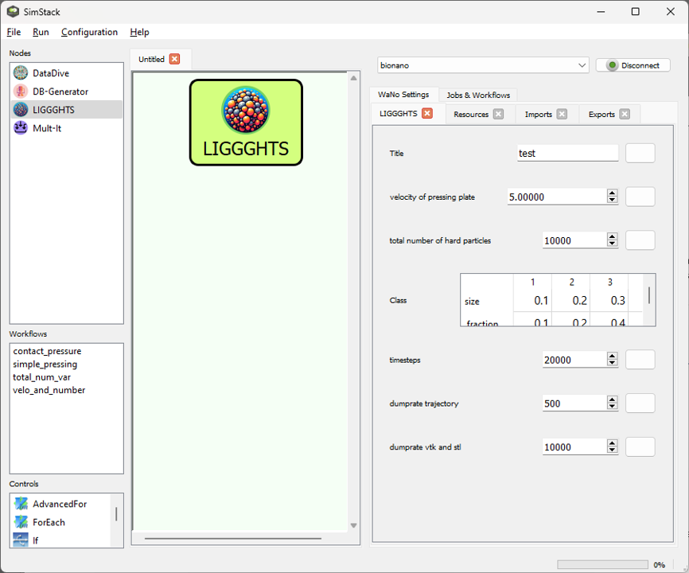

 

When publishing results obtained with LIGGGHTS WaNo, please consider citing it.

# LIGGGHTS and DataDive
---
These SimStack Wanos can be used to perform a pressing simulation with the DEM solver [LIGGGHTS](https://www.cfdem.com/liggghts-open-source-discrete-element-method-particle-simulation-code).
The LIGGGHTS WaNo creates a simulation input file using a preset template and the specified parameters. The DataDive Wano reads the results of LIGGGHTS and evaluates a stress-strain-curve.

# Parameters of the LIGGGHTS WaNo

This WaNo creates an input file name *workflow.inp* for a LIGGGTHS pressing simulation. In the simulation, a defined number of particles is created within a rectangular pressing die. After a short time to allow the particles to settle, the upper pressing plate moves downwards and presses on th eparticles with 100 MPa.  Two types of particles are specified, type 1 (*ceramic*) and type 2 (*polymer*). Polymer particles have a radius of 0.2 units.

The customizable parameters are from top to bottom:
- *Title*: An arbitrary title of this set of parameters.
- *velocity of pressing plate*: The velocity of the upper pressing plate moving downwards.
- *total number of hard particles*: The number of ceramic particles to be inserted. Should be max. 20000.

* Colab notebook for data visualization 
 
* Iterators
   * single variable: list(range(Mult-It.VarI-begin, Mult-It.VarI-end, Mult-It.Step))
   * two variables: itertools.product( list(np.linspace( Mult-It.VarF-begin , Mult-It.VarF-end , Mult-It.N-points )), list(range( Mult-It.VarI-begin, Mult-It.VarI-end, Mult-It.Step)) ) 
